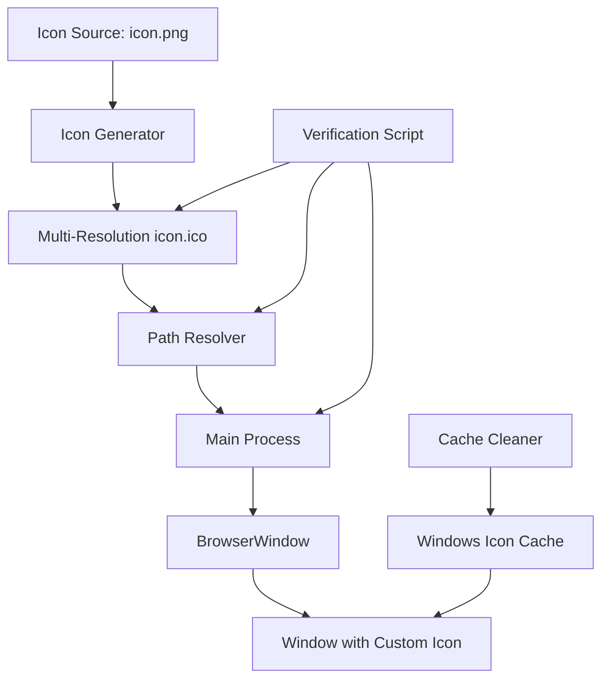

# Design Document: Application Icon Fix

## Overview

This design addresses the issue where an Electron application displays the default Electron icon instead of a custom application icon in the window title bar. The solution involves ensuring proper icon file format, correct path resolution in both development and production environments, proper BrowserWindow configuration, and providing utilities for icon cache management and verification.

The fix targets Windows platforms specifically, as the issue manifests in the Windows environment where icon caching and multi-resolution icon requirements are critical.

## Architecture

The solution consists of four main components:

1. **Icon File Generation**: Ensures the icon.ico file contains all required resolutions
2. **Path Resolution Module**: Handles correct icon path resolution across environments
3. **Window Configuration**: Properly configures BrowserWindow with the icon
4. **Utility Scripts**: Provides tools for cache clearing and verification



## Components and Interfaces

### 1. Icon File Structure

The icon.ico file must be a multi-resolution Windows icon containing the following sizes:
- 16x16 pixels (small icons, title bar)
- 32x32 pixels (taskbar, small window icons)
- 48x48 pixels (medium icons)
- 64x64 pixels (large icons)
- 128x128 pixels (extra large icons)
- 256x256 pixels (jumbo icons)

**Tool Selection**: Use `png-to-ico` npm package or ImageMagick for icon generation.

### 2. Path Resolution Module

```typescript
interface IconPathResolver {
  /**
   * Resolves the icon path based on the current environment
   * @returns Absolute path to the icon file
   */
  getIconPath(): string;
  
  /**
   * Checks if the icon file exists at the resolved path
   * @returns true if icon exists, false otherwise
   */
  iconExists(): boolean;
}
```

**Implementation Strategy**:
- In development: Use `path.join(__dirname, '../../build/icon.ico')`
- In production: Use `path.join(process.resourcesPath, 'build/icon.ico')`
- Use `app.isPackaged` to determine the environment

### 3. Main Process Configuration

The main process (src/main/index.ts) must:
1. Import the path resolution module
2. Resolve the icon path before creating windows
3. Pass the icon path to BrowserWindow options
4. Log icon loading status for debugging

```typescript
interface BrowserWindowOptions {
  icon: string;  // Absolute path to icon file
  // ... other options
}
```

### 4. Build Configuration

The electron-builder configuration in package.json must include:

```json
{
  "build": {
    "win": {
      "icon": "build/icon.ico",
      "target": ["nsis"]
    },
    "extraResources": [
      {
        "from": "build/icon.ico",
        "to": "build/icon.ico"
      }
    ]
  }
}
```

### 5. Utility Scripts

#### Icon Verification Script
- Checks icon file existence
- Validates icon file format and resolutions
- Verifies configuration in package.json
- Outputs diagnostic information

#### Cache Clearing Script (Windows)
- Stops Windows Explorer
- Deletes IconCache.db files
- Restarts Windows Explorer
- Requires administrator privileges

## Data Models

### Icon Configuration

```typescript
interface IconConfig {
  sourcePath: string;        // Path to source PNG (build/icon.png)
  outputPath: string;        // Path to output ICO (build/icon.ico)
  sizes: number[];           // Required icon sizes [16, 32, 48, 64, 128, 256]
}

interface IconVerificationResult {
  exists: boolean;
  hasAllSizes: boolean;
  missingSizes: number[];
  pathCorrect: boolean;
  configCorrect: boolean;
  errors: string[];
}
```

## Correctness Properties

*A property is a characteristic or behavior that should hold true across all valid executions of a system—essentially, a formal statement about what the system should do. Properties serve as the bridge between human-readable specifications and machine-verifiable correctness guarantees.*

