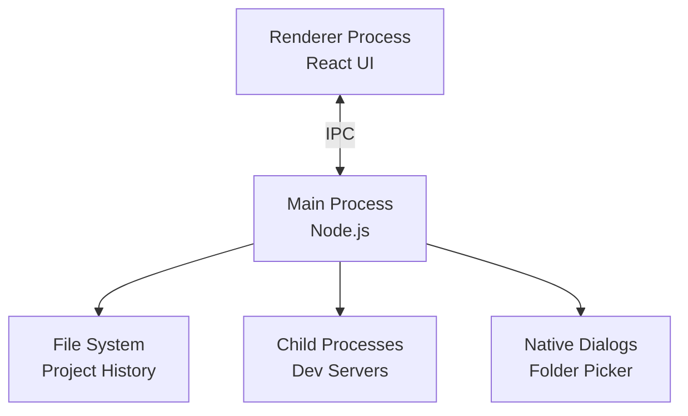

# Design Document: Auto Dev Launcher GUI

## Overview

The Auto Dev Launcher GUI is a cross-platform desktop application built with Electron and React that provides a graphical interface for managing and launching development servers. The application follows a client-side architecture with persistent local storage for project history and configuration.

### Technology Stack

- **Framework**: Electron (for cross-platform desktop application)
- **UI Library**: React with TypeScript
- **State Management**: React Context API + Hooks
- **Styling**: CSS Modules or Tailwind CSS
- **Process Management**: Node.js child_process module
- **Storage**: JSON files in platform-specific application data directories
- **Build Tool**: Vite or Webpack

### Key Design Decisions

1. **Electron over native frameworks**: Provides true cross-platform compatibility with a single codebase
2. **React for UI**: Component-based architecture enables reusable UI elements and clear separation of concerns
3. **File-based storage**: Simple JSON files for project history avoid database complexity
4. **Child process management**: Node.js built-in modules handle server process lifecycle

## Architecture

### Application Structure

```
auto-dev-launcher-gui/
├── src/
│   ├── main/                 # Electron main process
│   │   ├── index.ts          # Main process entry point
│   │   ├── ipc-handlers.ts   # IPC communication handlers
│   │   ├── process-manager.ts # Server process lifecycle management
│   │   └── storage.ts        # File system operations
│   ├── renderer/             # Electron renderer process (React UI)
│   │   ├── components/       # React components
│   │   │   ├── MainWindow.tsx
│   │   │   ├── ProjectList.tsx
│   │   │   ├── ProjectDetails.tsx
│   │   │   ├── ServerOutput.tsx
│   │   │   └── Toolbar.tsx
│   │   ├── hooks/            # Custom React hooks
│   │   │   ├── useProjectHistory.ts
│   │   │   └── useServerStatus.ts
│   │   ├── contexts/         # React contexts
│   │   │   └── AppContext.tsx
│   │   ├── types/            # TypeScript type definitions
│   │   │   └── index.ts
│   │   └── App.tsx           # Root React component
│   └── shared/               # Shared types and utilities
│       ├── types.ts
│       └── constants.ts
├── package.json
└── electron-builder.config.js
```

### Process Architecture

The application uses Electron's multi-process architecture:

1. **Main Process**: Handles system-level operations (file I/O, process spawning, native dialogs)
2. **Renderer Process**: Runs the React UI and handles user interactions
3. **IPC Communication**: Bidirectional communication between main and renderer processes



## Components and Interfaces

### Main Process Components

#### ProcessManager

Manages the lifecycle of development server processes.

```typescript
interface ProcessManager {
  // Start a development server for a project
  startServer(projectPath: string, config: DevConfig): Promise<ServerProcess>
  
  // Stop a running server
  stopServer(projectId: string): Promise<void>
  
  // Get status of a server
  getServerStatus(projectId: string): ServerStatus
  
  // Listen to server output
  onServerOutput(projectId: string, callback: (output: string) => void): void
}

interface ServerProcess {
  projectId: string
  pid: number
  status: 'starting' | 'running' | 'stopped' | 'error'
  startTime: Date
}

type ServerStatus = 'idle' | 'starting' | 'running' | 'stopped' | 'error'
```

#### StorageManager

Handles persistent storage of project history and application settings.

```typescript
interface StorageManager {
  // Load project history from disk
  loadProjectHistory(): Promise<ProjectHistoryEntry[]>
  
  // Save project history to disk
  saveProjectHistory(history: ProjectHistoryEntry[]): Promise<void>
  
  // Load application settings
  loadSettings(): Promise<AppSettings>
  
  // Save application settings
  saveSettings(settings: AppSettings): Promise<void>
  
  // Get platform-specific storage path
  getStoragePath(): string
}
```

#### IPCHandlers

Defines IPC communication channels between main and renderer processes.

```typescript
interface IPCHandlers {
  // Project operations
  'project:select-folder': () => Promise<string | null>
  'project:load-config': (projectPath: string) => Promise<DevConfig>
  'project:validate-config': (config: DevConfig) => Promise<ValidationResult>
  
  // Server operations
  'server:start': (projectPath: string, config: DevConfig) => Promise<void>
  'server:stop': (projectId: string) => Promise<void>
  'server:get-status': (projectId: string) => Promise<ServerStatus>
  
  // History operations
  'history:load': () => Promise<ProjectHistoryEntry[]>
  'history:add': (entry: ProjectHistoryEntry) => Promise<void>
  'history:remove': (projectId: string) => Promise<void>
  'history:clear': () => Promise<void>
  
  // File system operations
  'fs:open-in-explorer': (path: string) => Promise<void>
  'fs:check-path-exists': (path: string) => Promise<boolean>
}
```

### Renderer Process Components

#### MainWindow Component

Root component that orchestrates the entire UI.

```typescript
interface MainWindowProps {}

interface MainWindowState {
  selectedProject: ProjectHistoryEntry | null
  projectHistory: ProjectHistoryEntry[]
  serverStatuses: Map<string, ServerStatus>
}
```

#### ProjectList Component

Displays the list of historical projects.

```typescript
interface ProjectListProps {
  projects: ProjectHistoryEntry[]
  selectedProject: ProjectHistoryEntry | null
  onProjectSelect: (project: ProjectHistoryEntry) => void
  onProjectRemove: (projectId: string) => void
  onProjectOpenInExplorer: (projectPath: string) => void
}
```

#### ProjectDetails Component

Shows details of the selected project and launch controls.

```typescript
interface ProjectDetailsProps {
  project: ProjectHistoryEntry | null
  serverStatus: ServerStatus
  onLaunch: () => void
  onStop: () => void
}
```

#### ServerOutput Component

Displays real-time server output logs.

```typescript
interface ServerOutputProps {
  projectId: string
  output: string[]
  isRunning: boolean
}
```

#### Toolbar Component

Contains global actions like folder selection and refresh.

```typescript
interface ToolbarProps {
  onSelectFolder: () => void
  onRefresh: () => void
  onClearHistory: () => void
}
```

### Custom Hooks

#### useProjectHistory

Manages project history state and operations.

```typescript
function useProjectHistory() {
  const [history, setHistory] = useState<ProjectHistoryEntry[]>([])
  
  const loadHistory = async () => { /* ... */ }
  const addProject = async (project: ProjectHistoryEntry) => { /* ... */ }
  const removeProject = async (projectId: string) => { /* ... */ }
  const clearHistory = async () => { /* ... */ }
  
  return { history, loadHistory, addProject, removeProject, clearHistory }
}
```

#### useServerStatus

Tracks server status and output for projects.

```typescript
function useServerStatus(projectId: string) {
  const [status, setStatus] = useState<ServerStatus>('idle')
  const [output, setOutput] = useState<string[]>([])
  
  const startServer = async () => { /* ... */ }
  const stopServer = async () => { /* ... */ }
  
  return { status, output, startServer, stopServer }
}
```

## Data Models

### DevConfig

Configuration for starting a development server (from dev-config.json).

```typescript
interface DevConfig {
  command: string              // Command to execute (e.g., "npm run dev")
  cwd: string                  // Working directory
  env?: Record<string, string> // Environment variables
  port?: number                // Port number (optional)
  name?: string                // Project name (optional)
}
```

### ProjectHistoryEntry

Represents a project in the history list.

```typescript
interface ProjectHistoryEntry {
  id: string                   // Unique identifier (hash of path)
  name: string                 // Project name
  path: string                 // Absolute path to project directory
  lastLaunched: Date           // Last launch timestamp
  config: DevConfig            // Cached dev config
}
```

### AppSettings

Application-wide settings.

```typescript
interface AppSettings {
  windowBounds: {
    width: number
    height: number
    x?: number
    y?: number
  }
  theme: 'light' | 'dark' | 'system'
  maxHistoryEntries: number    // Maximum number of history entries to keep
}
```

### ValidationResult

Result of configuration validation.

```typescript
interface ValidationResult {
  valid: boolean
  errors: ValidationError[]
}

interface ValidationError {
  field: string
  message: string
}
```

## Correctness Properties

*A property is a characteristic or behavior that should hold true across all valid executions of a system—essentially, a formal statement about what the system should do. Properties serve as the bridge between human-readable specifications and machine-verifiable correctness guarantees.*


### Property 1: Folder picker displays on button click
*For any* application state, when the folder selection button is clicked, a native folder picker dialog should be displayed.
**Validates: Requirements 1.1**

### Property 2: Valid directory selection loads project
*For any* valid directory path selected in the folder picker, the application should load that directory as the current project.
**Validates: Requirements 1.2**

### Property 3: Cancel preserves state
*For any* current application state, canceling the folder picker dialog should leave the state unchanged.
**Validates: Requirements 1.3**

### Property 4: Config file parsing
*For any* directory containing a valid dev-config.json file, the application should successfully parse and validate the configuration.
**Validates: Requirements 1.4**

### Property 5: Missing config error handling
*For any* directory that does not contain a dev-config.json file, the application should display an error message and prevent launching.
**Validates: Requirements 1.5**

### Property 6: Successful launch adds to history
*For any* project that launches successfully, that project should be added to the project history.
**Validates: Requirements 2.1**

### Property 7: History persistence round-trip
*For any* project history state, saving on application close and loading on application start should restore the same history state.
**Validates: Requirements 2.2, 2.3**

### Property 8: History entry structure
*For any* project in the history, the entry should contain the project directory path, project name, and last launch timestamp.
**Validates: Requirements 2.4**

### Property 9: History deduplication (idempotence)
*For any* project launched multiple times, the history should contain only one entry for that project with an updated timestamp, not duplicate entries.
**Validates: Requirements 2.5**

### Property 10: All history projects displayed
*For any* project history, all entries should be visible in the project list UI.
**Validates: Requirements 3.1**

### Property 11: Project display information completeness
*For any* project entry rendered in the list, the display should include the project name, directory path, and last launch time.
**Validates: Requirements 3.2**

### Property 12: Project selection highlighting
*For any* project in the project list, clicking on it should result in that project being visually highlighted as selected.
**Validates: Requirements 3.4**

### Property 13: History sorting invariant
*For any* project history, the displayed list should be sorted by last launch time in descending order (most recent first).
**Validates: Requirements 3.5**

### Property 14: Launch button starts server
*For any* selected project with a valid configuration, clicking the launch button should start the server process using that project's dev config.
**Validates: Requirements 4.1**

### Property 15: Loading indicator during startup
*For any* server process that is starting, a loading indicator should be visible in the UI.
**Validates: Requirements 4.2**

### Property 16: Success status on successful start
*For any* server process that starts successfully, a success status message should be displayed.
**Validates: Requirements 4.3**

### Property 17: Error message on start failure
*For any* server process that fails to start, an error message with failure details should be displayed.
**Validates: Requirements 4.4**

### Property 18: Launch button disabled when running
*For any* project with a running server process, the launch button for that project should be disabled.
**Validates: Requirements 4.5**

### Property 19: Server status transitions
*For any* server process, the status indicator should display "Running" when the process is running and "Stopped" when the process stops.
**Validates: Requirements 5.1, 5.2**

### Property 20: Server output display
*For any* server process output, that output should be displayed in the dedicated log viewer area.
**Validates: Requirements 5.3**

### Property 21: Auto-scroll to latest output
*For any* new server output, the log viewer should automatically scroll to show the latest output at the bottom.
**Validates: Requirements 5.4**

### Property 22: JSON syntax validation
*For any* file loaded as dev-config.json, the application should validate that it contains valid JSON syntax and reject invalid JSON.
**Validates: Requirements 6.1**

### Property 23: Required fields validation
*For any* dev config object, validation should verify that required fields (command, cwd) are present and fail validation if they are missing.
**Validates: Requirements 6.2**

### Property 24: Validation error messages
*For any* invalid dev config, specific validation error messages should be displayed indicating what is wrong.
**Validates: Requirements 6.3**

### Property 25: Launch enabled for valid config
*For any* project with a valid dev config, the launch button should be enabled.
**Validates: Requirements 6.4**

### Property 26: Optional fields support
*For any* dev config with or without optional fields (env, port), the config should be accepted as valid if required fields are present.
**Validates: Requirements 6.5**

### Property 27: Window bounds persistence
*For any* window size and position, closing the application and reopening it should restore the same window bounds.
**Validates: Requirements 7.5**

### Property 28: Platform-appropriate storage paths
*For any* platform (Windows, macOS, Linux), the application should store configuration files in the platform-appropriate location (AppData, ~/.config, ~/Library respectively).
**Validates: Requirements 8.5**

### Property 29: Error message display
*For any* error that occurs in the application, a user-friendly error message should be displayed to the user.
**Validates: Requirements 9.1, 9.2, 9.4**

### Property 30: Non-existent project removal offer
*For any* project in history whose directory no longer exists, the application should offer to remove it from the history.
**Validates: Requirements 9.3**

### Property 31: Error logging
*For any* error that occurs, detailed error information should be logged for debugging purposes.
**Validates: Requirements 9.5**

### Property 32: Context menu on right-click
*For any* project in the project list, right-clicking on it should display a context menu.
**Validates: Requirements 10.1**

### Property 33: History removal updates list
*For any* project removed from history, the project list should update immediately to reflect the removal.
**Validates: Requirements 10.4**

## Error Handling

### Error Categories

1. **File System Errors**
   - Directory not found
   - Permission denied
   - File read/write failures
   - Invalid paths

2. **Configuration Errors**
   - Missing dev-config.json
   - Invalid JSON syntax
   - Missing required fields
   - Invalid field values

3. **Process Errors**
   - Server start failures
   - Server crashes
   - Command not found
   - Port already in use

4. **Validation Errors**
   - Invalid project structure
   - Unsupported configuration format

### Error Handling Strategy

1. **User-Facing Errors**: Display clear, actionable error messages in modal dialogs or inline notifications
2. **Technical Errors**: Log detailed stack traces and error context to application logs
3. **Recoverable Errors**: Offer retry options or alternative actions (e.g., remove invalid project from history)
4. **Fatal Errors**: Display error message and gracefully shut down if necessary

### Error Message Format

```typescript
interface ErrorMessage {
  title: string           // Short error title
  message: string         // User-friendly description
  details?: string        // Technical details (collapsible)
  actions?: ErrorAction[] // Available actions
}

interface ErrorAction {
  label: string
  handler: () => void
}
```

## Testing Strategy

### Dual Testing Approach

The application will use both unit tests and property-based tests to ensure comprehensive coverage:

- **Unit Tests**: Verify specific examples, edge cases, and error conditions
- **Property Tests**: Verify universal properties across all inputs using randomized testing

Both testing approaches are complementary and necessary. Unit tests catch concrete bugs in specific scenarios, while property tests verify general correctness across a wide range of inputs.

### Property-Based Testing

**Library**: fast-check (JavaScript/TypeScript property-based testing library)

**Configuration**:
- Minimum 100 iterations per property test
- Each test must reference its design document property
- Tag format: `// Feature: auto-dev-launcher-gui, Property N: [property text]`

**Example Property Test**:

```typescript
import fc from 'fast-check'

// Feature: auto-dev-launcher-gui, Property 9: History deduplication (idempotence)
test('launching a project multiple times creates only one history entry', () => {
  fc.assert(
    fc.property(
      fc.record({
        path: fc.string(),
        name: fc.string(),
        config: fc.record({
          command: fc.string(),
          cwd: fc.string()
        })
      }),
      fc.integer({ min: 1, max: 10 }),
      async (project, launchCount) => {
        const history = new ProjectHistory()
        
        // Launch the same project multiple times
        for (let i = 0; i < launchCount; i++) {
          await history.addProject(project)
        }
        
        // Should only have one entry
        const entries = history.getAll()
        expect(entries.length).toBe(1)
        expect(entries[0].path).toBe(project.path)
      }
    ),
    { numRuns: 100 }
  )
})
```

### Unit Testing

**Framework**: Jest or Vitest

**Focus Areas**:
- Specific examples of valid and invalid configurations
- Edge cases (empty history, missing files, invalid paths)
- Error conditions (network failures, permission errors)
- UI component rendering
- IPC communication

**Example Unit Test**:

```typescript
describe('DevConfig Validation', () => {
  test('should reject config missing required command field', () => {
    const invalidConfig = {
      cwd: '/path/to/project'
      // missing 'command' field
    }
    
    const result = validateDevConfig(invalidConfig)
    
    expect(result.valid).toBe(false)
    expect(result.errors).toContainEqual({
      field: 'command',
      message: 'Required field "command" is missing'
    })
  })
  
  test('should accept config with optional fields', () => {
    const validConfig = {
      command: 'npm run dev',
      cwd: '/path/to/project',
      env: { NODE_ENV: 'development' },
      port: 3000
    }
    
    const result = validateDevConfig(validConfig)
    
    expect(result.valid).toBe(true)
    expect(result.errors).toHaveLength(0)
  })
})
```

### Integration Testing

**Focus**: End-to-end workflows
- Complete project launch workflow (select folder → validate config → start server → display output)
- History management workflow (add project → close app → reopen → verify history restored)
- Error recovery workflow (invalid config → display error → fix config → retry)

### Test Coverage Goals

- **Unit Tests**: 80%+ code coverage
- **Property Tests**: All 33 correctness properties implemented
- **Integration Tests**: All major user workflows covered
- **Manual Testing**: Cross-platform compatibility verification

### Testing Tools

- **Unit/Integration**: Jest or Vitest
- **Property-Based**: fast-check
- **E2E**: Playwright or Spectron (Electron testing)
- **Coverage**: Istanbul/nyc
- **CI/CD**: GitHub Actions or similar

## Implementation Notes

### Security Considerations

1. **Path Validation**: Sanitize all file paths to prevent directory traversal attacks
2. **Command Injection**: Validate and sanitize commands before execution
3. **Process Isolation**: Run server processes with appropriate permissions
4. **Data Validation**: Validate all user inputs and configuration data

### Performance Considerations

1. **Lazy Loading**: Load project history on demand
2. **Output Buffering**: Buffer server output to prevent UI freezing
3. **Process Limits**: Limit number of concurrent server processes
4. **Memory Management**: Clean up stopped processes and old logs

### Accessibility

1. **Keyboard Navigation**: Full keyboard support for all UI elements
2. **Screen Reader Support**: Proper ARIA labels and roles
3. **High Contrast**: Support for high contrast themes
4. **Focus Management**: Clear focus indicators

### Future Enhancements

1. **Project Groups**: Organize projects into folders or tags
2. **Custom Commands**: Support for multiple commands per project
3. **Environment Profiles**: Switch between different environment configurations
4. **Log Filtering**: Search and filter server output
5. **Notifications**: Desktop notifications for server events
6. **Multi-Server**: Launch multiple servers simultaneously
