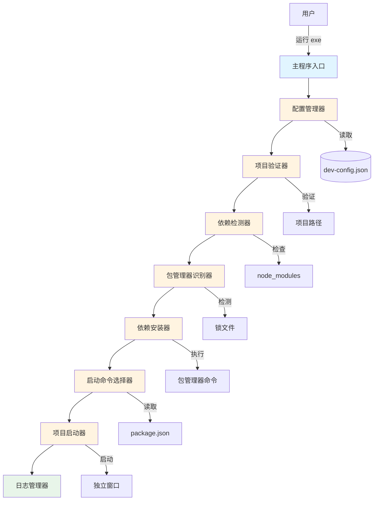
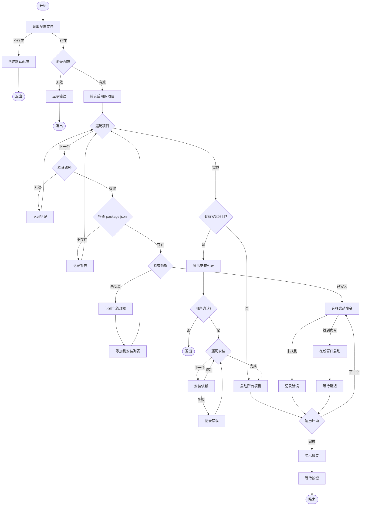
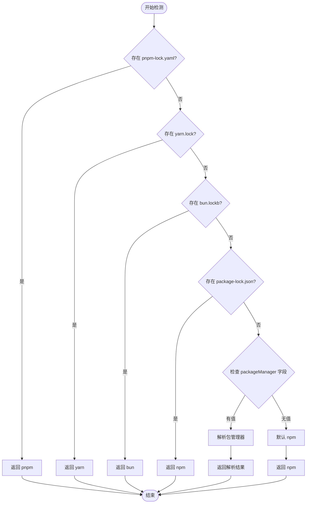
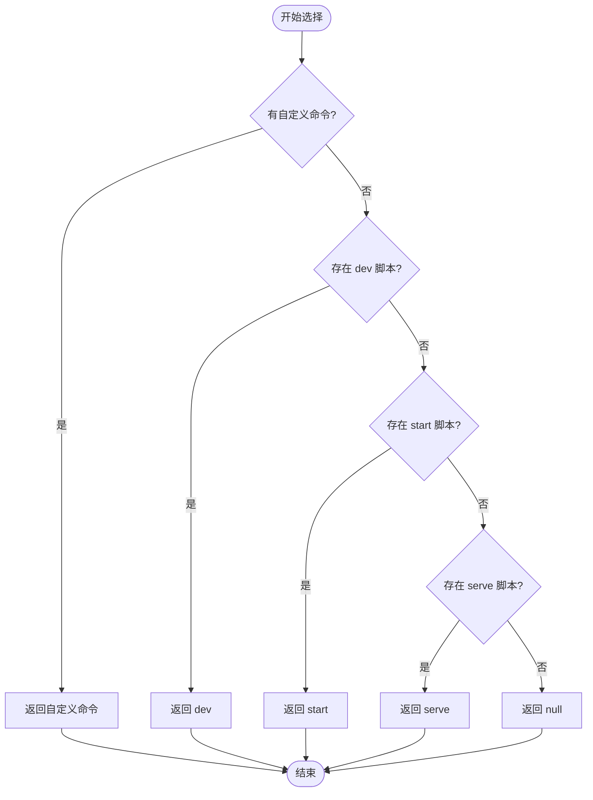

# 设计文档

## 概述

自动开发服务器启动工具是一个基于 Node.js 的命令行工具，旨在简化多项目开发环境的启动流程。该工具通过智能检测项目状态、自动安装依赖、识别包管理器类型，并在独立窗口中启动开发服务器，大幅提升开发效率。

核心设计理念：
- **智能化**：自动检测依赖状态和包管理器类型
- **可靠性**：完善的错误处理和日志输出
- **易用性**：配置简单，一键启动
- **可移植性**：打包成独立 exe 文件，无需 Node.js 环境

## 架构

### 系统架构图



### 模块划分

系统采用模块化设计，主要包含以下核心模块：

1. **配置管理模块** (ConfigManager)
   - 负责读取、验证和管理配置文件
   - 提供配置文件模板生成功能

2. **项目验证模块** (ProjectValidator)
   - 验证项目路径有效性
   - 检查 package.json 存在性
   - 路径规范化处理

3. **依赖检测模块** (DependencyDetector)
   - 检测 node_modules 目录状态
   - 判断是否需要安装依赖

4. **包管理器识别模块** (PackageManagerDetector)
   - 通过锁文件识别包管理器类型
   - 支持 npm、pnpm、yarn、bun

5. **依赖安装模块** (DependencyInstaller)
   - 使用正确的包管理器安装依赖
   - 显示安装进度和结果

6. **启动命令选择模块** (StartCommandSelector)
   - 从 package.json 读取可用脚本
   - 智能选择启动命令

7. **项目启动模块** (ProjectLauncher)
   - 在独立窗口中启动项目
   - 管理多项目并行启动

8. **日志管理模块** (Logger)
   - 统一的日志输出接口
   - 支持不同级别和颜色的日志

## 组件和接口

### 1. 配置管理器 (ConfigManager)

```typescript
interface ProjectConfig {
  name: string;              // 项目名称
  path: string;              // 项目路径
  enabled: boolean;          // 是否启用
  customCommand?: string;    // 自定义启动命令（可选）
  env?: Record<string, string>; // 环境变量（可选）
  workDir?: string;          // 工作目录（可选）
  delay?: number;            // 启动延迟（秒，可选）
  skipDependencyCheck?: boolean; // 跳过依赖检查（可选）
}

interface Config {
  projects: ProjectConfig[];
  autoMode?: boolean;        // 自动模式，跳过确认（可选）
}

class ConfigManager {
  // 读取配置文件
  readConfig(configPath: string): Config;
  
  // 创建默认配置文件
  createDefaultConfig(configPath: string): void;
  
  // 验证配置文件格式
  validateConfig(config: Config): ValidationResult;
  
  // 获取配置文件路径（支持命令行参数）
  getConfigPath(): string;
}
```

### 2. 项目验证器 (ProjectValidator)

```typescript
interface ValidationResult {
  valid: boolean;
  errors: string[];
  warnings: string[];
}

class ProjectValidator {
  // 验证项目路径
  validatePath(projectPath: string): boolean;
  
  // 检查 package.json 是否存在
  hasPackageJson(projectPath: string): boolean;
  
  // 规范化路径（相对路径转绝对路径）
  normalizePath(projectPath: string, basePath: string): string;
  
  // 完整验证项目
  validate(project: ProjectConfig): ValidationResult;
}
```

### 3. 依赖检测器 (DependencyDetector)

```typescript
interface DependencyStatus {
  hasNodeModules: boolean;   // node_modules 是否存在
  isEmpty: boolean;          // node_modules 是否为空
  needsInstall: boolean;     // 是否需要安装依赖
}

class DependencyDetector {
  // 检测依赖状态
  detect(projectPath: string): DependencyStatus;
  
  // 检查 node_modules 目录
  checkNodeModules(projectPath: string): boolean;
  
  // 检查 node_modules 是否为空
  isNodeModulesEmpty(projectPath: string): boolean;
}
```

### 4. 包管理器识别器 (PackageManagerDetector)

```typescript
type PackageManager = 'npm' | 'pnpm' | 'yarn' | 'bun';

interface LockFileMapping {
  'pnpm-lock.yaml': 'pnpm';
  'yarn.lock': 'yarn';
  'bun.lockb': 'bun';
  'package-lock.json': 'npm';
}

class PackageManagerDetector {
  // 检测包管理器类型
  detect(projectPath: string): PackageManager;
  
  // 检查特定锁文件是否存在
  hasLockFile(projectPath: string, lockFileName: string): boolean;
  
  // 获取包管理器安装命令
  getInstallCommand(pm: PackageManager): string;
  
  // 获取包管理器运行命令
  getRunCommand(pm: PackageManager, script: string): string;
}
```

### 5. 依赖安装器 (DependencyInstaller)

```typescript
interface InstallResult {
  success: boolean;
  output: string;
  error?: string;
}

class DependencyInstaller {
  // 安装依赖
  install(projectPath: string, pm: PackageManager): Promise<InstallResult>;
  
  // 执行安装命令
  executeInstall(projectPath: string, command: string): Promise<InstallResult>;
  
  // 显示安装进度
  showProgress(projectName: string, output: string): void;
}
```

### 6. 启动命令选择器 (StartCommandSelector)

```typescript
interface PackageJson {
  scripts?: Record<string, string>;
  [key: string]: any;
}

class StartCommandSelector {
  // 读取 package.json
  readPackageJson(projectPath: string): PackageJson;
  
  // 选择启动命令
  selectCommand(packageJson: PackageJson, customCommand?: string): string | null;
  
  // 检查脚本是否存在
  hasScript(packageJson: PackageJson, scriptName: string): boolean;
  
  // 获取优先级列表中的第一个可用脚本
  getFirstAvailableScript(packageJson: PackageJson, priorities: string[]): string | null;
}
```

### 7. 项目启动器 (ProjectLauncher)

```typescript
interface LaunchOptions {
  projectName: string;
  projectPath: string;
  command: string;
  env?: Record<string, string>;
  workDir?: string;
}

interface LaunchResult {
  success: boolean;
  error?: string;
}

class ProjectLauncher {
  // 启动项目
  launch(options: LaunchOptions): LaunchResult;
  
  // 在新窗口中启动
  launchInNewWindow(options: LaunchOptions): LaunchResult;
  
  // 设置窗口标题
  setWindowTitle(title: string): string;
  
  // 构建启动命令
  buildCommand(options: LaunchOptions): string;
}
```

### 8. 日志管理器 (Logger)

```typescript
type LogLevel = 'info' | 'success' | 'warning' | 'error';

interface LogOptions {
  color?: string;
  prefix?: string;
}

class Logger {
  // 记录信息
  info(message: string, options?: LogOptions): void;
  
  // 记录成功
  success(message: string, options?: LogOptions): void;
  
  // 记录警告
  warning(message: string, options?: LogOptions): void;
  
  // 记录错误
  error(message: string, options?: LogOptions): void;
  
  // 显示项目处理开始
  startProject(projectName: string, projectPath: string): void;
  
  // 显示摘要
  showSummary(total: number, success: number, failed: number): void;
}
```

### 9. 主程序入口 (Main)

```typescript
class AutoDevLauncher {
  private configManager: ConfigManager;
  private projectValidator: ProjectValidator;
  private dependencyDetector: DependencyDetector;
  private packageManagerDetector: PackageManagerDetector;
  private dependencyInstaller: DependencyInstaller;
  private startCommandSelector: StartCommandSelector;
  private projectLauncher: ProjectLauncher;
  private logger: Logger;
  
  // 主执行流程
  async run(): Promise<void>;
  
  // 处理单个项目
  async processProject(project: ProjectConfig): Promise<boolean>;
  
  // 用户确认
  async confirmInstallation(projects: ProjectConfig[]): Promise<boolean>;
  
  // 显示欢迎信息
  showWelcome(): void;
  
  // 等待用户按键退出
  waitForExit(): Promise<void>;
}
```

## 数据模型

### 配置文件结构 (dev-config.json)

```json
{
  "projects": [
    {
      "name": "前端项目",
      "path": "E:\\projects\\frontend",
      "enabled": true,
      "customCommand": "dev",
      "env": {
        "NODE_ENV": "development",
        "PORT": "3000"
      },
      "workDir": null,
      "delay": 2,
      "skipDependencyCheck": false
    }
  ],
  "autoMode": false
}
```

### Package.json 结构（相关部分）

```json
{
  "name": "my-project",
  "scripts": {
    "dev": "vite",
    "start": "node server.js",
    "serve": "vue-cli-service serve"
  },
  "packageManager": "pnpm@8.0.0"
}
```

### 锁文件映射

| 包管理器 | 锁文件名称 | 安装命令 | 运行命令 |
|---------|-----------|---------|---------|
| npm | package-lock.json | npm install | npm run {script} |
| pnpm | pnpm-lock.yaml | pnpm install | pnpm run {script} |
| yarn | yarn.lock | yarn install | yarn run {script} |
| bun | bun.lockb | bun install | bun run {script} |

## 执行流程

### 主流程图



### 包管理器检测流程



### 启动命令选择流程



## 打包方案

### 选择 pkg 作为打包工具

经过调研，选择 [pkg](https://github.com/vercel/pkg) 作为打包工具，原因如下：

1. **成熟稳定**：由 Vercel 维护，社区活跃
2. **跨平台支持**：支持 Windows、Linux、macOS
3. **简单易用**：配置简单，一条命令即可打包
4. **体积优化**：支持压缩和优化
5. **资源打包**：支持将配置文件等资源打包进 exe

### 打包配置

在 package.json 中添加 pkg 配置：

```json
{
  "name": "auto-dev-launcher",
  "version": "1.0.0",
  "bin": "dist/index.js",
  "pkg": {
    "targets": [
      "node18-win-x64"
    ],
    "outputPath": "build",
    "assets": [
      "templates/**/*"
    ],
    "scripts": [
      "dist/**/*.js"
    ]
  },
  "scripts": {
    "build": "tsc",
    "package": "pkg . --out-path build"
  }
}
```

### 打包步骤

1. **编译 TypeScript**：`npm run build`
2. **打包成 exe**：`npm run package`
3. **输出文件**：`build/auto-dev-launcher.exe`

### 资源文件处理

默认配置文件模板将作为资源打包进 exe：

```
templates/
  └── dev-config.template.json
```

首次运行时，如果当前目录没有 dev-config.json，程序会从模板创建。

## 错误处理

### 错误分类

1. **配置错误**
   - 配置文件不存在
   - 配置文件格式错误
   - 配置项缺失或无效

2. **路径错误**
   - 项目路径不存在
   - package.json 不存在
   - 路径权限不足

3. **依赖错误**
   - 依赖安装失败
   - 包管理器不可用
   - 网络连接问题

4. **启动错误**
   - 启动命令不存在
   - 端口被占用
   - 权限不足

### 错误处理策略

```typescript
class ErrorHandler {
  // 处理配置错误
  handleConfigError(error: Error): void {
    logger.error('配置文件错误');
    logger.error(error.message);
    logger.info('提示：请检查 dev-config.json 文件格式');
    process.exit(1);
  }
  
  // 处理路径错误
  handlePathError(projectName: string, path: string): void {
    logger.warning(`项目 "${projectName}" 路径不存在: ${path}`);
    logger.info('提示：请检查配置文件中的路径是否正确');
    // 继续处理其他项目
  }
  
  // 处理依赖安装错误
  handleInstallError(projectName: string, error: string): void {
    logger.error(`项目 "${projectName}" 依赖安装失败`);
    logger.error(error);
    logger.info('提示：请检查网络连接或手动安装依赖');
    // 继续处理其他项目
  }
  
  // 处理启动错误
  handleLaunchError(projectName: string, error: string): void {
    logger.error(`项目 "${projectName}" 启动失败`);
    logger.error(error);
    logger.info('提示：请检查启动命令是否正确');
    // 继续处理其他项目
  }
}
```

### 错误恢复机制

- **单项目失败不影响其他项目**：采用容错设计，一个项目失败不会中断整个流程
- **详细错误信息**：提供清晰的错误描述和可能的解决方案
- **日志记录**：所有错误都会被记录，便于排查问题
- **优雅退出**：在关键错误时提供清晰的退出信息

## 正确性属性

*属性是一个特征或行为，应该在系统的所有有效执行中保持为真——本质上是关于系统应该做什么的形式化陈述。属性作为人类可读规范和机器可验证正确性保证之间的桥梁。*


### 属性反思

在编写正确性属性之前，我对预分析中识别的可测试标准进行了反思，以消除冗余：

**合并的属性：**
1. 需求 4.2-4.6（包管理器识别的具体锁文件）可以合并为一个综合属性，测试锁文件到包管理器的映射
2. 需求 5.2-5.5（不同包管理器的安装命令）可以合并为一个属性，测试包管理器到命令的映射
3. 需求 6.2-6.4（启动命令优先级）可以合并为一个属性，测试命令选择的优先级逻辑
4. 需求 11.1-11.6（配置选项支持）可以合并为一个属性，测试配置解析的完整性

**消除的冗余：**
1. 需求 3.2 和 3.4 可以合并为一个属性，因为它们都是关于依赖状态判断的
2. 需求 5.6 和 5.7 可以合并为一个属性，因为它们是同一流程的两个分支
3. 需求 7.2 和 7.3 可以合并为一个属性，因为它们都是关于窗口配置的

### 正确性属性列表

**属性 1：配置文件读取的一致性**
*对于任何*有效的配置文件，系统读取后应该能够准确还原所有配置项的值，包括项目列表、启用状态和所有可选字段。
**验证需求：1.1, 1.4, 1.5**

**属性 2：配置文件格式验证**
*对于任何*格式错误的配置文件（缺少必需字段、类型错误、JSON 语法错误），系统应该拒绝该配置并显示描述性错误信息。
**验证需求：1.3**

**属性 3：路径规范化的往返一致性**
*对于任何*相对路径，将其转换为绝对路径后，两个路径应该指向文件系统中的同一位置。
**验证需求：2.5**

**属性 4：路径验证的正确性**
*对于任何*项目配置，如果项目路径不存在或不包含 package.json，系统应该跳过该项目并记录相应的错误或警告。
**验证需求：2.1, 2.2, 2.3, 2.4**

**属性 5：依赖状态检测的准确性**
*对于任何*项目路径，如果 node_modules 目录不存在或为空，系统应该标记该项目需要安装依赖；如果 node_modules 存在且包含文件，应该标记依赖已安装。
**验证需求：3.1, 3.2, 3.3, 3.4**

**属性 6：包管理器识别的映射正确性**
*对于任何*项目路径，系统应该根据锁文件的存在正确识别包管理器类型：pnpm-lock.yaml → pnpm，yarn.lock → yarn，bun.lockb → bun，package-lock.json → npm，无锁文件 → npm（默认）。
**验证需求：4.1, 4.2, 4.3, 4.4, 4.5, 4.6**

**属性 7：包管理器命令映射的正确性**
*对于任何*包管理器类型（npm、pnpm、yarn、bun），系统应该使用正确的安装命令和运行命令格式。
**验证需求：5.1, 5.2, 5.3, 5.4, 5.5**

**属性 8：依赖安装流程的容错性**
*对于任何*依赖安装操作，无论成功或失败，系统都应该继续处理其他项目，不应该因为单个项目的失败而中断整个流程。
**验证需求：5.6, 5.7, 12.3**

**属性 9：启动命令选择的优先级正确性**
*对于任何*package.json 文件，系统应该按照以下优先级选择启动命令：自定义命令 > dev > start > serve，如果都不存在则返回 null。
**验证需求：6.2, 6.3, 6.4, 6.5, 6.6**

**属性 10：启动命令与包管理器的组合正确性**
*对于任何*项目，系统应该使用识别到的包管理器执行选择的启动命令，命令格式应该符合该包管理器的规范。
**验证需求：6.7**

**属性 11：项目启动顺序的保持性**
*对于任何*配置文件中的项目列表，系统启动项目的顺序应该与配置文件中的顺序完全一致。
**验证需求：7.5**

**属性 12：窗口配置的完整性**
*对于任何*启动的项目，新窗口应该包含项目名称作为标题，并在窗口中显示项目路径和启动命令。
**验证需求：7.2, 7.3**

**属性 13：启动延迟的一致性**
*对于任何*连续启动的两个项目，系统应该在启动第二个项目前等待配置的延迟时间（默认 2 秒）。
**验证需求：7.4**

**属性 14：日志完整性**
*对于任何*处理的项目，系统应该在日志中记录项目名称、路径、依赖状态、包管理器类型和启动状态。
**验证需求：3.5, 4.7, 8.2, 8.3, 8.4, 8.5, 8.6**

**属性 15：统计信息的准确性**
*对于任何*执行完成的会话，系统显示的成功和失败项目数量之和应该等于尝试处理的项目总数。
**验证需求：8.8**

**属性 16：用户确认流程的正确性**
*对于任何*需要安装依赖的项目列表，如果用户取消确认，系统应该终止执行；如果用户确认或配置了自动模式，系统应该继续执行安装。
**验证需求：10.3, 10.4, 10.5**

**属性 17：配置扩展字段的解析正确性**
*对于任何*包含扩展字段（customCommand、env、workDir、delay、skipDependencyCheck）的项目配置，系统应该正确解析并应用这些配置，未指定的字段应该使用合理的默认值。
**验证需求：11.1, 11.2, 11.3, 11.4, 11.5, 11.6**

**属性 18：特殊字符路径处理的鲁棒性**
*对于任何*包含特殊字符（空格、中文、符号）的路径和项目名称，系统应该能够正确处理而不产生错误。
**验证需求：12.6, 12.7**

## 测试策略

### 双重测试方法

本项目采用单元测试和基于属性的测试相结合的方法，以确保全面的代码覆盖：

**单元测试**：
- 验证特定示例和边缘情况
- 测试错误条件和异常处理
- 测试组件之间的集成点
- 重点关注：
  - 配置文件不存在时创建默认模板（需求 1.2）
  - 特定锁文件的包管理器识别示例（需求 4.2-4.6）
  - 用户交互流程的特定场景（需求 10.1, 10.2, 10.6）
  - 启动摘要显示（需求 7.6）
  - 并发限制测试（需求 12.5）

**基于属性的测试**：
- 验证跨所有输入的通用属性
- 通过随机化实现全面的输入覆盖
- 重点关注：
  - 配置文件解析和验证（属性 1, 2, 17）
  - 路径处理和验证（属性 3, 4, 18）
  - 依赖检测和安装（属性 5, 7, 8）
  - 包管理器识别（属性 6）
  - 启动命令选择（属性 9, 10）
  - 项目启动流程（属性 11, 12, 13）
  - 日志和统计（属性 14, 15）
  - 用户交互（属性 16）

### 基于属性的测试配置

**测试框架选择**：使用 [fast-check](https://github.com/dubzzz/fast-check) 作为 TypeScript 的属性测试库。

**测试配置**：
- 每个属性测试最少运行 100 次迭代
- 每个测试必须引用其设计文档中的属性
- 标签格式：`Feature: auto-dev-launcher, Property {number}: {property_text}`

**示例测试结构**：

```typescript
import fc from 'fast-check';

describe('Property 1: 配置文件读取的一致性', () => {
  // Feature: auto-dev-launcher, Property 1: 配置文件读取的一致性
  it('should accurately restore all config values after reading', () => {
    fc.assert(
      fc.property(
        fc.record({
          projects: fc.array(fc.record({
            name: fc.string(),
            path: fc.string(),
            enabled: fc.boolean(),
            customCommand: fc.option(fc.string()),
            env: fc.option(fc.dictionary(fc.string(), fc.string())),
            workDir: fc.option(fc.string()),
            delay: fc.option(fc.nat()),
            skipDependencyCheck: fc.option(fc.boolean())
          })),
          autoMode: fc.option(fc.boolean())
        }),
        (config) => {
          // 写入配置文件
          const configPath = writeConfigToTempFile(config);
          
          // 读取配置文件
          const readConfig = configManager.readConfig(configPath);
          
          // 验证所有值都被准确还原
          expect(readConfig).toEqual(config);
          
          // 清理
          cleanupTempFile(configPath);
        }
      ),
      { numRuns: 100 }
    );
  });
});
```

### 测试覆盖目标

- 代码覆盖率：≥ 85%
- 属性测试覆盖：所有 18 个正确性属性
- 单元测试覆盖：所有关键边缘情况和错误条件
- 集成测试：端到端流程验证

### 持续集成

- 所有测试在每次提交时自动运行
- 属性测试失败时保存反例以便重现
- 性能测试定期运行以确保符合需求 12.1-12.2

## 实现注意事项

### 技术选型

- **语言**：TypeScript（类型安全，易于维护）
- **运行时**：Node.js 18+
- **打包工具**：pkg（成熟稳定，社区支持好）
- **测试框架**：Jest + fast-check
- **日志库**：chalk（彩色输出）
- **命令行交互**：inquirer（用户确认）

### 性能优化

1. **并行处理**：依赖检测和包管理器识别可以并行进行
2. **缓存机制**：缓存已验证的路径和读取的 package.json
3. **延迟加载**：只在需要时加载大型依赖
4. **流式输出**：安装进度实时显示，不阻塞主流程

### 安全考虑

1. **路径注入防护**：验证和清理所有路径输入
2. **命令注入防护**：使用参数化命令执行，不使用字符串拼接
3. **权限检查**：在执行操作前检查文件系统权限
4. **错误信息脱敏**：不在错误信息中暴露敏感路径

### 可维护性

1. **模块化设计**：每个模块职责单一，易于测试和替换
2. **接口抽象**：使用接口定义模块间的契约
3. **配置驱动**：通过配置文件控制行为，减少硬编码
4. **文档完善**：代码注释、API 文档、用户手册齐全

### 扩展性

1. **插件机制**：预留插件接口，支持自定义包管理器和启动命令
2. **配置扩展**：配置文件支持自定义字段，向后兼容
3. **日志扩展**：支持自定义日志格式和输出目标
4. **平台扩展**：虽然当前只支持 Windows，但架构设计考虑了跨平台扩展

## 部署和分发

### 构建流程

1. **开发环境**：
   ```bash
   npm install
   npm run dev
   ```

2. **构建**：
   ```bash
   npm run build
   ```

3. **打包**：
   ```bash
   npm run package
   ```

4. **输出**：
   - `build/auto-dev-launcher.exe`（Windows 可执行文件）
   - 大小：约 30-40MB（包含 Node.js 运行时）

### 分发方式

1. **直接分发**：将 exe 文件复制到目标机器
2. **配置文件**：首次运行自动创建 dev-config.json 模板
3. **更新机制**：通过替换 exe 文件更新（未来可考虑自动更新）

### 使用流程

1. 将 `auto-dev-launcher.exe` 放置在任意目录
2. 首次运行会创建 `dev-config.json` 模板
3. 编辑 `dev-config.json` 配置项目信息
4. 双击 `auto-dev-launcher.exe` 启动所有项目
5. 查看日志输出，确认启动状态
6. 各项目在独立窗口中运行

## 未来改进方向

1. **GUI 界面**：提供图形化配置界面
2. **项目模板**：内置常见项目类型的配置模板
3. **健康检查**：定期检查项目运行状态
4. **日志聚合**：收集所有项目的日志到统一界面
5. **远程管理**：支持通过 Web 界面远程管理项目
6. **跨平台支持**：扩展到 Linux 和 macOS
7. **Docker 支持**：支持启动 Docker 容器化的项目
8. **环境切换**：支持多套环境配置快速切换
