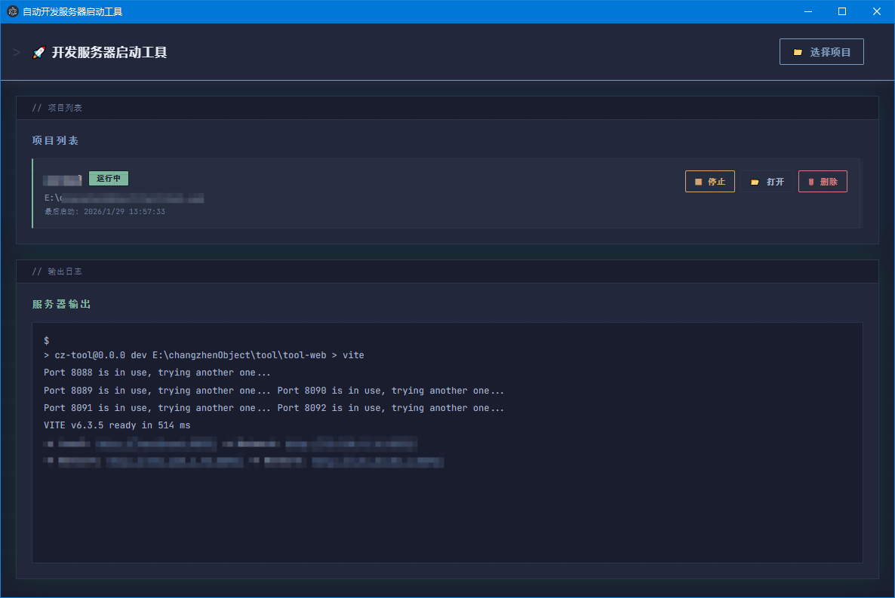

# 开发服务器启动工具（Auto Dev Launcher）

基于 `Tauri 2 + React 19 + Rust` 的桌面应用，用于统一管理本地项目并一键启动开发服务。



## 项目现状

- 桌面端已迁移到 `Tauri`
- 前端统一通过 `src/renderer/lib/desktop.ts` 调用桌面能力
- 支持托盘、开机自启（Windows）、关闭窗口最小化到托盘

## 主要功能

- 自动读取项目配置（优先 `dev-config.json`，其次 `package.json`）
- 无配置时自动生成启动命令（根据锁文件识别 `pnpm/yarn/npm`）
- 启动项目时若缺少 `node_modules`，自动执行依赖安装
- 管理多个项目的启动状态、停止状态与历史记录
- 实时日志输出，支持错误筛选与关键字搜索
- 自动识别本地 URL（如 `localhost:5173`）并可点击打开
- 删除项目前会先确认；若项目运行中会先停止再删除
- 退出应用时会先停止所有已启动项目再安全退出
- 统一的应用内中文弹窗（提示 / 确认），支持 `ESC` 取消、`Enter` 确认、点击遮罩关闭

## 桌面行为设置

- `开机自启`：Windows 登录后自动启动应用
- `关闭时最小化到托盘`：关闭按钮不退出应用，只隐藏到系统托盘
- 托盘左键：显示主窗口
- 托盘右键菜单：`显示主窗口` / `退出`
- 原生标题栏使用应用主题深色（`#162033`）：仅 Windows 11（build 22000+）生效，旧系统自动降级为系统默认色

## 技术栈

- `Tauri 2`
- `React 19`
- `Vite 7`
- `Rust`
- `TypeScript`
- `Vitest`

## 开发环境

- `Node.js 20+`
- `pnpm`
- `Rust`（含 `cargo`）

如果在 Windows 下执行 `pnpm tauri dev` 或 `pnpm tauri build` 时提示找不到 `cargo`，先将以下目录加入 `PATH`：

```powershell
$env:Path = "$env:USERPROFILE\.cargo\bin;$env:Path"
```

## 快速开始

```bash
pnpm install
pnpm run dev
```

开发模式前端地址固定为：`http://127.0.0.1:4173`

## 常用命令

```bash
pnpm install
pnpm run dev
pnpm run dev:web
pnpm run test
pnpm run build:web
pnpm run build
pnpm run clean
pnpm run package:win:nosign
```

- `pnpm run dev`：启动 Tauri 开发模式
- `pnpm run dev:web`：仅启动前端开发服务（Vite）
- `pnpm run test`：运行前端测试（Vitest）
- `pnpm run build:web`：构建前端资源
- `pnpm run build`：执行 Tauri 构建
- `pnpm run clean`：清理构建产物与打包目录
- `pnpm run package:win:nosign`：生成 Windows NSIS 包并整理到 `release-packages/`

## 配置文件

### `dev-config.json`（推荐）

```json
{
  "name": "my-project",
  "command": "pnpm run dev",
  "cwd": "E:/workspace/my-project",
  "port": 5173,
  "env": {
    "NODE_ENV": "development"
  }
}
```

字段说明：

- `command`：启动命令（必填）
- `cwd`：工作目录（必填）
- `name`：项目显示名（可选）
- `port`：端口（可选）
- `env`：环境变量（可选）

### 自动配置规则（无 `dev-config.json` 时）

- 检测 `package.json` 的脚本优先级：`dev` > `start` > `serve` > `start`（兜底）
- 根据锁文件识别包管理器：`pnpm-lock.yaml` > `yarn.lock` > `npm`
- 生成命令形如：`pnpm run dev`

## 打包输出

默认 Tauri bundle 输出目录：

```text
src-tauri/target/release/bundle/
```

打包后脚本会自动整理产物到：

```text
release-packages/
```

例如：

```text
Auto Dev Launcher_2.0.0_x64-setup.exe
```

只验证 Rust 侧编译（不产出安装包）：

```powershell
$env:Path = "$env:USERPROFILE\.cargo\bin;$env:Path"
pnpm tauri build --debug --no-bundle
```

## 项目结构

```text
src/
  renderer/
    components/            React 组件（项目列表、日志面板、弹窗等）
    contexts/              应用状态管理与弹窗上下文（AppContext / DialogContext）
    lib/desktop.ts         桌面能力调用封装（Tauri API）
    App.tsx                主界面与交互逻辑
    main.tsx               前端入口
  shared/types.ts          前后端共享类型

src-tauri/
  src/config.rs            项目配置解析与校验
  src/process_manager.rs   进程启动/停止、日志采集、URL 检测
  src/storage.rs           历史与设置持久化
  src/lib.rs               Tauri 命令注册、托盘、窗口行为与标题栏主题色
  src/main.rs              桌面应用入口
  tauri.conf.json          Tauri 构建与窗口配置

scripts/
  clean.js                     清理构建与打包目录
  verify-icon.js               校验图标配置
  collect-release-packages.js  整理打包产物
```

## 故障排查

### 1. 找不到 `cargo`

确认已安装 Rust，并将 `%USERPROFILE%\.cargo\bin` 加入系统环境变量或当前终端 `PATH`。

### 2. 端口 4173 被占用

`dev:web` 固定使用 `127.0.0.1:4173` 且 `strictPort=true`。请先释放端口后再执行 `pnpm run dev`。

### 3. 删除项目后未立即生效

应用会先尝试停止项目进程，再执行删除；如果停止失败，会保留记录并提示错误。

## 相关文档

- `docs/CHANGELOG.md`：版本更新记录
- `docs/DESIGN_NOTES.md`：界面设计说明
- `docs/TAURI_MIGRATION.md`：迁移记录
- `scripts/README.md`：脚本说明